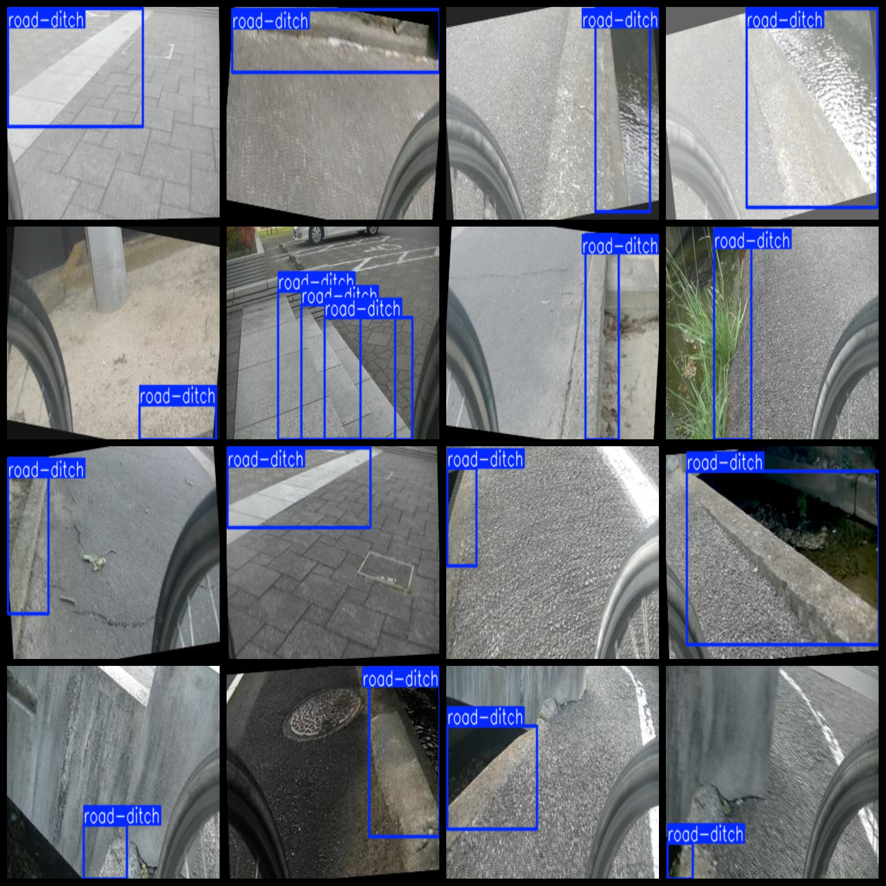

# Curb Detection Dataset: 1404 Images in VOC+YOLO Format

The curb detection dataset consists of 1404 images in the VOC+YOLO format.

Dataset format: Pascal VOC format combined with YOLO format (excluding the split path's txt file, only including jpg images along with their corresponding VOC format xml files and YOLO format txt files).

Number of images (in jpg format): 1404

Number of annotations (in xml format): 1404

Number of annotations (in txt format): 1404

Number of annotation categories: 1

Repository where the dataset is stored: datasets_sl

Annotation category name: "road-ditch"

Number of boxes per category:

Number of boxes for "road-ditch": 1619

Total number of boxes: 1619

Number of images per category:

"road-ditch" occupies 1404 images

Image resolution: 320x200

Labeling tool used: labelImg

Dataset enhancement status: No

Annotation rules: Draw a box around the class label

Important notice: The dataset does not include a partition for training, validation, or test sets; you must create your own.

Special declaration: This dataset does not guarantee any accuracy for models trained on it or weight files.

Annotation and image details are as follows:

## Images

---

Here is a pay link on Stripe (https://buy.stripe.com/3cs8yP7sY87d0vu9AB). Please contact me lonlonago@foxmail.com after funding $89, and I will send you a complete data files, thank you!

